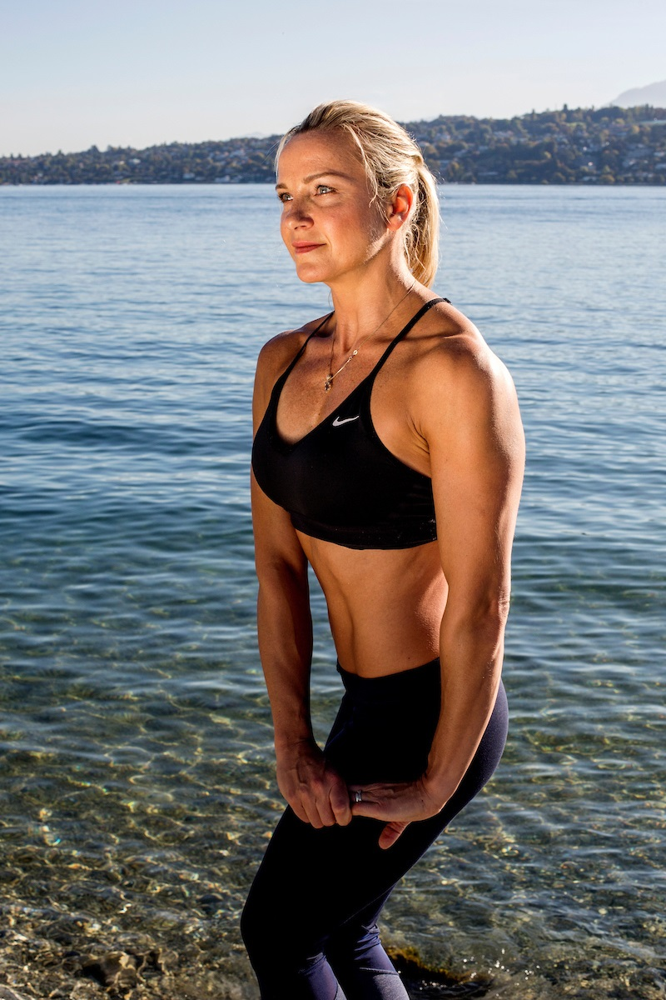

# elizaskander.com — Netlify Site

A clean, fast static website for Eliza Skander — personal trainer and nutrition coach based in Geneva.

## File structure

```
elizaskander/
├── index.html              ← Homepage
├── pages/
│   ├── workouts.html       ← All workouts with filter
│   ├── recipes.html        ← Recipes + video recipes
│   ├── transformations.html← Body transformation results
│   └── contact.html        ← Contact form (Netlify Forms)
├── css/
│   └── style.css           ← Shared styles
├── js/
│   └── main.js             ← Nav + scroll reveal
├── images/                 ← Add your photos here
│   └── (add eliza-hero.jpg here)
└── netlify.toml            ← Netlify config
```

## How to deploy to Netlify

### Option A — Drag and drop (easiest)
1. Go to https://app.netlify.com
2. Log in (or create a free account)
3. Drag the entire `elizaskander` folder onto the Netlify dashboard
4. Your site goes live instantly at a random URL like `amazing-koala-123.netlify.app`
5. In Netlify settings → Domain → Add custom domain → type `elizaskander.com`
6. Netlify will give you nameservers to point to

### Option B — GitHub (recommended for updates)
1. Create a GitHub repo and push this folder to it
2. In Netlify: New site → Import from Git → Select your repo
3. Build command: (leave empty)
4. Publish directory: `.`
5. Deploy. Now every git push auto-deploys.

## How to point your domain (one.com → Netlify)

1. In Netlify: Site settings → Domain management → Add custom domain → `elizaskander.com`
2. Netlify shows you nameservers, e.g.:
   - `dns1.p01.nsone.net`
   - `dns2.p01.nsone.net`
3. Log into your one.com control panel
4. Go to: Domain → DNS & Nameservers → Change nameservers
5. Replace with Netlify's nameservers
6. Save. DNS propagates within 1–48 hours (usually under 2 hours).
7. Once live and confirmed working → cancel one.com hosting (keep the domain registered if you want, or transfer it)

## Adding your photo

Replace the placeholder in the hero section:

In `index.html`, find this comment:
```html
<!-- Replace the placeholder below with:  -->
```

Replace the entire `<div class="hero-photo-placeholder">` block with:
```html

```

Best photo: portrait orientation, you in athletic wear, good lighting. 800×1200px minimum.

## Updating your real email

Search and replace `elizaskander@yahoo.com` with your actual email address across all files.

## Contact form

The contact form uses **Netlify Forms** — zero setup required. When someone submits the form:
- Netlify captures it automatically (no backend needed)
- You get an email notification
- View all submissions at: app.netlify.com → Your site → Forms

To set the notification email: Netlify → Site settings → Forms → Form notifications → Add notification → Email notification.

## Adding real workout/recipe content

Each workout card has a `data-category` attribute for filtering. To add a new workout, copy a `<div class="workout-card">` block and change:
- The emoji in `.workout-thumb`
- The `data-category` (options: full-body, strength, abs, lower, cardio, kettlebell)
- The difficulty class (diff-beginner / diff-intermediate / diff-advanced)
- The title, description, duration

Same pattern applies to recipe cards in `recipes.html`.
